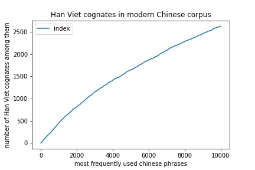

# Overview

This Jupyter Notebook aims to answer this question:

```
How many modern Chinese words have a modern Vietnamese Han Viet cognate?
```

# Getting Started

You'll need to have [python3](https://www.python.org/downloads/) installed, and some basic knowledge of how to run a [Jupyter notebook](https://jupyter.org/).

Create a virtual environment. This step is optional, but recommended as all requirements will be installed locally and won't interfere with your other python projects.
```
python3 -m venv env
source env/bin/activate
```

Install project requirements:
```
pip install -r requirements.txt
```

Run Jupyterlab:
```
jupyter lab
```

Run the notebook `chinese-hanviet.ipynb`

# Background

*Sep-2021*

I have been learning Chinese over the past few months; and is currently looking at building up my Chinese vocabulary. As a Vietnamese speaker, I have always had a feeling that many Chinese words I stumble upon are similar to Vietnamese words.

Indeed that is the case, because many Vietnamese words were borrowed from Chinese.

A majority of these loanwords belong to a layer called [Han Viet](https://en.wikipedia.org/wiki/Sino-Vietnamese_vocabulary) that were borrowed from Middle Chinese. In linguistics, these words and their Modern Chinese counterparts are called [cognates](https://en.wikipedia.org/wiki/Cognate).

There is also an **Old Sino-Vietnamese** layer consisting of a few hundred words borrowed from earlier Chinese. Most of these words have existed for long enough and have had their sounds diverged enough from their Chinese counterparts that they are considered by Vietnamese as native; and hence I will not consider them in this project. There is also a layer of more recently borrowed words from Modern Chinese, which I believe is small enough that we can safely ignore in view of our practical purpose.

Anyway, the layer of Han Viet itself is quite extensive. Its extensive existence makes it easier for a Vietnamese to learn Chinese, compared to someone whose native langauge is English, for example.

But how easy?

I set out to answer this question. More specifically, this:

```
How many modern Chinese words have a modern Vietnamese Han Viet cognate?
```

I also want to have a nice list of these words, so that perhaps I could focus on studying first, to be more efficient with my vocabulary building.

* **Why Modern Chinese?** Because it's the language I'm interested in learning (not Classical Chinese).

* **Why Modern Vietnamese?** Because that's my native language. It means that as much as I can, I shold ignore Han Viet cognates that are not familiar to a typical modern Vietnamese (like myself).

* **Why Han Viet?** As explained above, we are going to ignore the Old Sino-Vietnamese layer and the layer of words borrowed from modern Chinese.

# Methodology

### 1. Starting with Chinese phrases

To start off, we need a Chinese words frequency list. I chose the [Leeds database](http://corpus.leeds.ac.uk/frqc/internet-zh.num); but I've also included the [BLCU database](https://www.plecoforums.com/threads/word-frequency-list-based-on-a-15-billion-character-corpus-bcc-blcu-chinese-corpus.5859/) which can be run against with some minor tweaks in the code. Either of them should be good for our purpose.

Note that both lists are based on Simplified Chinese.

### 2. Translating to Han Viet sounds

Next, we need to find the corresponding Han Viet sounds for each Chinese words. This is done by looking up the [Thiều Chữu dictionary](https://vi.wikipedia.org/wiki/Thi%E1%BB%81u_Ch%E1%BB%ADu).

The Thiều Chữu dictionary is character-dictionary, not word. It means that for each word, we need to find out the sound for each character and combine them together. For example:
```
我 = ngã
们 = môn
hence: 我们 = ngã môn
```

Sometimes, each character has many sounds. In that case, all combinations are produced. For example:
```
利害 = lợi hại, lợi hạt
```

The Thieu Chuu dictionary has both simplified Chinese and traditional Chinese characters. However it is not always consistent. For example:
```
过 = quá
but
過 = qua, quá
```
To ensure that we don't miss out on some sound because, we also produce the Han Viet sounds based on traditional version of the words.

This ensure we produce all possible Han Viet sounds for words like this:
```
通过 = thông qua, thông quá
```

But it also produce some unintended Han Viet sounds. For example:
```
有着 = hữu trứ, dựu khán, hữu khán, dựu trứ
```
But don't worry, we will deal with these in the next step.

There is also a problem with the Thiều Chữu dictionary where some character only exist as a non-standard variant, for example `硏` instead of `研` (note the very minor difference), or `伱` instead of `你`. As a result, we missed out picking up cognates such as `研究 / nghiên cứu`. To mitigate this problem, we supplement the Thiều Chữu list with a list of sound obtained from the Chinese-Vietnamese translation community, in the file [phienam.txt](inputs/phienam.txt).

### 3. Which ones are legitimate Han Viet words?

Finally, we need to find out which one of these Han Viet sounds are actually valid modern Han Viet words.

To do this, we rely on the file [vietphrases.txt](inputs/vietphrases.txt) produced by a Vietnamese translation community (`source missing`). This file contains the translation of common Chinese phrases. Let's take a look at a few examples:

```
批准=phê chuẩn/chuẩn y/chuẩn phê/duyệt y/bằng lòng/thông qua
黑脸=mặt đen
```
The first word, ```批准``` is a cognate with the Han Viet word ```phê chuẩn```.

The second word ```黑脸```, even though producing three Han Viet sound ```hắc kiểm, hắc liễm, hắc kiểm```, none of these is a valid Han Viet word. That's why the Vietnamese translation only include the native Vietnamese word ```mặt đen```.

That is the trick we're going to do here: we're going to recognize a word as a valid Han Viet word if its Han Viet sound exist in the translation.

This is nowhere near foolproofed, and it depends on the quality of this file `vietphrases.txt`. But our assumption here is that if a word is good enough to be included in the Vietnamese translation by the translation community, we're going to assume that it is a word recognisable by a typical Vietnamese.

# Results

### List of Han Viet cognates

The full list of 8,141 words can be downloaded from [chinese-hanviet-cognates.tsv](outputs/chinese-hanviet-cognates.tsv). An example of the first 100 entries can be found at the end of this document.

It could be useful for a Vietnamese learning Chinese looking for a list of easy to learn words.

The full list of 20,816 non-cognates can also be downloaded from [chinese-hanviet-non-cognates.tsv](outputs/chinese-hanviet-non-cognates.tsv). This is also an interesting list to look at because while the first list sounds familiar to a Vietnamese speaker, this second list almost feels like it's an entirely different language.

### Chart

I also plotted the first column against the second column:



As can be seen from this, around 1/3 of the most frequently used modern Chinese phrases have a Han Viet cognate.

The steeper slope on the left side of the chart means that this ratio is slightly higher among the top most frequently used Chinese phrases.

### Limitations

1. This is perhaps the biggest limitation: as can be seen from the example list above, words like `大家` is indicated as having its cognate as `đại gia` (influential family). While this is technically true, this meaning is not as frequently used as the common meaning `mọi người` (everybody); certainly not frequently enough to warrant it to be in the top 36th spot. This is a problem with frequency list - there is no distinction between different meanings of the same word. Therefore, if you are a language learner, you should use this list with care and bear in mind that quite often these Chinese words don't have the same meaning as the primary meaning of the Han Viet words.

2. The project is done based on a frequency list, which means that it is based on Chinese phrases rather than words (as opposed to using a dictionary). However I believe that for the purpose of language learning, this is more useful.

3. I decided to remove single-syllabic words from the result because I think most single-syllabic cognates are not well-understood by native Vietnamese speakers. For example words like `骑 / kỵ` may be marked as a valid Han Viet word; but many people will have no idea what it means, unless it's put in the context of a multi-syllabic word like `骑士 / kỵ sĩ`. Again, this is a practical decision, motivated by my language learning need.

4. As mentioned above, I ignored the Old Sino-Vietnamese layers. This is because on one hand, identifying them is HARD, and on the other hand, these words have diverged enough from their modern Chinese cognates that it's not too useful for language learners to know them.

5. There is also a problem of matching different spelling variations of the same Vietnamese word. For example, the system fails to detect `công ti` as a match of `công ty`. As a result, some of these words are missed out from the final result.

6. On the other hand, some words are misidentified as a cognate. For example: `一些 / nhất ta` - I don't think this is a legitimate modern Vietnamese word). At the end of the day, the result is only as good as the data I have, which is not of research-quality. I haven't manually vetted through any of the input data. But I believe it's good enough for my language learning need.

# Further Works

* More analysis on single-syllabic cognates.

* Replace Thiều Chữu dictionary with a more comprehensive way to produce Han Viet sound. Perhaps [Thi Vien](https://hvdic.thivien.net/)?

* Run the final results against a more colloquial Vietnamese word list, to weed out "dictionary" words that the common man is not familiar with. For example [this frequency list](https://github.com/garfieldnate/vi_experiments/tree/master/opensubs_word_list) collected from Open Subtitles.

* Manual vetting of the results.

# Credits

* [Leeds database](http://corpus.leeds.ac.uk/frqc/internet-zh.num)
* [BLCU database](https://www.plecoforums.com/threads/word-frequency-list-based-on-a-15-billion-character-corpus-bcc-blcu-chinese-corpus.5859/)
* Thiều Chữu dictionary
* **vietphrases.txt** and **phienam.txt** provided by Chinese-Vietnamese translation community
* Thanks to [anh Tran Chi Hieu](https://www.facebook.com/504631273/) for contributing valuable advices and data

All data are owned by their respective owners. As much as I can, I try to cite the source of the data. If you are the owner of the data and would like your data to be removed, please email me at ryan.phung@gmail.com.

# Appendix

|index|chinese_rank|frequency|word|traditional|pinyin   |matched    |meaning                                                                                                                                                                                                    |
|-----|------------|---------|----|-----------|---------|-----------|-----------------------------------------------------------------------------------------------------------------------------------------------------------------------------------------------------------|
|1    |5           |1332.15  |可以  |可以         |kěyǐ     |khả dĩ     |có thể/khả dĩ/có khả năng/có năng lực/cho phép/được phép/tốt/giỏi/hay/lợi hại/ghê hồn/cừ khôi/ghê gớm                                                                                                      |
|2    |8           |1106.78  |中国  |中國         |zhōngguó |trung quốc |Trung Quốc/Trung Hoa Trung Quốc/China/nước cộng hoà nhân dân Trung Hoa                                                                                                                                     |
|3    |13          |916.48   |现在  |現在         |xiànzài  |hiện tại   |hiện tại/hiện nay/bây giờ                                                                                                                                                                                  |
|4    |16          |831.2    |时间  |時間         |shíjiān  |thời gian  |thời gian/giờ/khoảng thời gian/thời điểm                                                                                                                                                                   |
|5    |18          |775.81   |问题  |問題         |wèntí    |vấn đề     |vấn đề/câu hỏi/đề hỏi/quan trọng/mấu chốt/chuyện/trở ngại/trắc trở                                                                                                                                         |
|6    |20          |734.66   |工作  |工作         |gōngzuò  |công tác   |công tác/làm việc/việc làm/nghề nghiệp/công việc/nhiệm vụ/nghiệp vụ                                                                                                                                        |
|7    |23          |621.34   |学生  |學生         |xuéshēng |học sinh   |đệ tử/học sinh/học trò/con trai                                                                                                                                                                            |
|8    |24          |601.9    |所以  |所以         |suǒyǐ    |sở dĩ      |cho nên/sở dĩ/đó là lí do mà/nguyên cớ/vì sao/nguyên do                                                                                                                                                    |
|9    |25          |597.97   |第一  |第一         |dìyī     |đệ nhất    |thứ nhất/đệ nhất/đầu tiên/hạng nhất/bậc nhất/quan trọng nhất                                                                                                                                               |
|10   |26          |589.67   |一些  |一些         |yīxiē    |nhất ta    |một ít/chút/một số/một phần/mấy/hơi/một chút/nhất ta                                                                                                                                                       |
|11   |31          |568.4    |生活  |生活         |shēnghuó |sinh hoạt  |cuộc sống/sinh hoạt/đời sống/sinh tồn/tồn tại/mức sống/việc/công việc                                                                                                                                      |
|12   |32          |566.18   |不能  |不能         |bùnéng   |bất năng   |không thể/bất năng/không nổi/bất lực/không hiệu lực/không có khả năng/bất tài/không được phép/không đủ sức                                                                                                 |
|13   |33          |565.46   |孩子  |孩子         |háizǐ    |hài tử     |đứa nhỏ/hài tử/nhi đồng/trẻ em/trẻ con/con nít/em bé/con cái/con                                                                                                                                           |
|14   |36          |523.07   |大家  |大家         |dàjiā    |đại gia    |mọi người/đại gia/chuyên gia/người nổi tiếng/bậc thầy/họ lớn/thế gia vọng tộc                                                                                                                              |
|15   |37          |517.6    |可能  |可能         |kěnéng   |khả năng   |có thể/khả năng/khả thi/thực hiện được/làm được/có lẽ/hoặc giả/chắc là                                                                                                                                     |
|16   |47          |470.89   |东西  |東西         |dōngxī   |đông tây   |đồ vật này nọ/đông tây/phía đông và phía tây/từ đông sang tây/đồ/vật/thứ/đồ đạc/đồ vật đồ                                                                                                                  |
|17   |48          |467.23   |北京  |北京         |běijīng  |bắc kinh   |Bắc Kinh/Beijing                                                                                                                                                                                           |
|18   |52          |439.7    |地方  |地方         |dìfāng   |địa phương |địa phương/chỗ/bản xứ/bản địa/nơi ấy/chốn ấy/nơi/vùng/miền bộ phận/phần                                                                                                                                    |
|19   |54          |435.13   |非常  |非常         |fēicháng |phi thường |phi thường/đặc biệt/bất thường/không bình thường/rất/vô cùng/cực kỳ/hết sức                                                                                                                                |
|20   |55          |434.38   |发现  |發現         |fāxiàn   |phát hiện  |phát hiện/tìm ra/tìm tòi/phát giác/cảm thấy                                                                                                                                                                |
|21   |56          |428.48   |不过  |不過         |bùguò    |bất quá    |bất quá/cực kỳ/hết mức/nhất trên đời/hơn hết/vừa mới/vừa/chỉ/chẳng qua/chỉ vì/chỉ có/nhưng/nhưng mà/có điều là/song/chỉ có điều                                                                            |
|22   |57          |427.06   |今天  |今天         |jīntiān  |kim thiên  |hôm nay/ngày hôm nay/hiện tại/trước mắt/kim thiên                                                                                                                                                          |
|23   |60          |417.63   |世界  |世界         |shìjiè   |thế giới   |thế giới/vũ trụ/trái đất/thời buổi                                                                                                                                                                         |
|24   |62          |410.19   |一定  |一定         |yīdìng   |nhất định  |nhất định/chính xác/quy định/tất nhiên/cần phải/chắc chắn/riêng                                                                                                                                            |
|25   |64          |405.86   |进行  |進行         |jìnxíng  |tiến hành  |tiến hành/làm/tiến lên/tiến tới/tiến lên phía trước                                                                                                                                                        |
|26   |69          |391.68   |朋友  |朋友         |péngyǒu  |bằng hữu   |bằng hữu/bạn bè/bạn/người yêu                                                                                                                                                                              |
|27   |70          |389.11   |国家  |國家         |guójiā   |quốc gia   |quốc gia/nhà nước/đất nước/lãnh thổ                                                                                                                                                                        |
|28   |72          |387.14   |所有  |所有         |suǒyǒu   |sở hữu     |tất cả/sở hữu/vật sở hữu/hết thảy/toàn bộ                                                                                                                                                                  |
|29   |73          |382.93   |个人  |個人         |gèrén    |cá nhân    |cá nhân/người/riêng tôi/cá nhân tôi                                                                                                                                                                        |
|30   |74          |377.52   |发展  |發展         |fāzhǎn   |phát triển |phát triển/mở rộng/khuếch trương                                                                                                                                                                           |
|31   |75          |374.82   |最后  |最後         |zùihòu   |tối hậu    |cuối cùng/tối hậu/sau cùng                                                                                                                                                                                 |
|32   |79          |365.5    |电话  |電話         |diànhuà  |điện thoại |điện thoại/máy điện thoại/dây nói                                                                                                                                                                          |
|33   |81          |364.72   |老师  |老師         |lǎoshī   |lão sư     |lão sư/thầy cô giáo/bậc thầy                                                                                                                                                                               |
|34   |82          |363.35   |学习  |學習         |xuéxí    |học tập    |học tập/học                                                                                                                                                                                                |
|35   |86          |347.8    |当时  |當時         |dāngshí  |đương thời |lúc ấy/lúc đó/khi đó/đương thời/lập tức/liền/ngay lúc đó/ngay lúc ấy                                                                                                                                       |
|36   |87          |344.15   |情况  |情況         |qíngkuàng|tình huống |tình huống/tình hình                                                                                                                                                                                       |
|37   |89          |343.32   |社会  |社會         |shèhùi   |xã hội     |xã hội/hình thái xã hội                                                                                                                                                                                    |
|38   |91          |339.89   |希望  |希望         |xīwàng   |hy vọng    |hy vọng/mong muốn/ước ao/mong/ý muốn/ước muốn/nguyện vọng/niềm hi vọng/mong ngóng                                                                                                                          |
|39   |93          |331.77   |感觉  |感覺         |gǎnjué   |cảm giác   |cảm giác/cảm thấy/cho rằng                                                                                                                                                                                 |
|40   |95          |331.28   |女人  |女人         |nv̌rén   |nữ nhân    |nữ nhân/phụ nữ/đàn bà/vợ                                                                                                                                                                                   |
|41   |96          |326.67   |第二  |第二         |dìèr     |đệ nhị     |đệ nhị/thứ hai                                                                                                                                                                                             |
|42   |97          |325.21   |其实  |其實         |qíshí    |kỳ thật    |kỳ thật/kỳ thực/thực ra                                                                                                                                                                                    |
|43   |98          |325.1    |事情  |事情         |shìqíng  |sự tình    |sự tình/chuyện/sự việc                                                                                                                                                                                     |
|44   |104         |303.44   |过去  |過去         |guòqù    |quá khứ    |quá khứ/đi tới/đã qua/trước đây/đi qua/qua/mất/chết/tạ thế                                                                                                                                                 |
|45   |106         |299.29   |教育  |教育         |jiàoyù   |giáo dục   |giáo dục/đào tạo/dạy dỗ/dạy bảo/chỉ dẫn/chỉ thị/dạy                                                                                                                                                        |
|46   |108         |296.8    |文化  |文化         |wénhuà   |văn hóa    |văn hóa/văn hoá                                                                                                                                                                                            |
|47   |109         |293.61   |特别  |特別         |tèbié    |đặc biệt   |đặc biệt/vô cùng/rất/riêng biệt/chuyên biệt/càng/nhất là                                                                                                                                                   |
|48   |111         |289.96   |当然  |當然         |dāngrán  |đương nhiên|đương nhiên/nên như thế/phải thế/tất nhiên/dĩ nhiên                                                                                                                                                        |
|49   |112         |289.89   |要求  |要求         |yàoqíu   |yêu cầu    |yêu cầu/đòi hỏi/hi vọng/nguyện vọng                                                                                                                                                                        |
|50   |113         |286.96   |妈妈  |媽媽         |māmā     |mụ mụ      |mụ mụ/mẹ/má/me/u/bầm/mẫu thân/mợ                                                                                                                                                                           |
|51   |115         |283.2    |不同  |不同         |bùtóng   |bất đồng   |bất đồng/khác nhau/khác biệt                                                                                                                                                                               |
|52   |116         |280.62   |出现  |出現         |chūxiàn  |xuất hiện  |xuất hiện/nảy sinh/ló ra/nổi lên/hiện ra                                                                                                                                                                   |
|53   |117         |279.59   |重要  |重要         |zhòngyào |trọng yếu  |trọng yếu/quan trọng                                                                                                                                                                                       |
|54   |118         |279.48   |通过  |通過         |tōngguò  |thông qua  |thông qua/đi qua/qua                                                                                                                                                                                       |
|55   |119         |279.16   |市场  |市場         |shìcháng |thị trường |thị trường/chợ                                                                                                                                                                                             |
|56   |120         |278.73   |日本  |日本         |rìběn    |nhật bổn   |Nhật Bổn/Nhật bản                                                                                                                                                                                          |
|57   |122         |275.85   |男人  |男人         |nánrén   |nam nhân   |nam nhân/trượng phu/chồng/đàn ông                                                                                                                                                                          |
|58   |124         |273.66   |英语  |英語         |yīngyǔ   |anh ngữ    |tiếng Anh/Anh ngữ/Anh văn                                                                                                                                                                                  |
|59   |125         |271.66   |一切  |一切         |yīqiē    |nhất thiết |hết thảy/tất cả/mọi/mọi thứ/toàn bộ/nhất thiết/hết thẩy                                                                                                                                                    |
|60   |126         |269.91   |活动  |活動         |huódòng  |hoạt động  |hoạt động/chuyển động/vận động/theo mục đích/vì mục đích nào đó/hành động có mục đích/lay động/lung lay/không ổn định/đung đưa/lắc lư/linh hoạt/di động/không cố định/sinh hoạt/chạy chọt/đút lót/mua chuộc|
|61   |128         |268.61   |大学  |大學         |dàxué    |đại học    |đại học                                                                                                                                                                                                    |
|62   |129         |267.09   |主要  |主要         |zhǔyào   |chủ yếu    |chủ yếu/chính                                                                                                                                                                                              |
|63   |130         |266.28   |经济  |經濟         |jīngjì   |kinh tế    |kinh tế/lợi hại/mức sống/đời sống/tiết kiệm/đỡ tốn kém/hạn chế/trị nước/trị quốc                                                                                                                           |
|64   |131         |265.54   |同时  |同時         |tóngshí  |đồng thời  |đồng thời/song song/trong khi/cùng lúc/hơn nữa                                                                                                                                                             |
|65   |132         |265.42   |研究  |研究         |yánjīu   |nghiên cứu |nghiên cứu/tìm tòi học hỏi                                                                                                                                                                                 |
|66   |133         |264.11   |关系  |關係         |guānxì   |quan hệ    |quan hệ/liên quan/liên quan đến/quan hệ đến/quan trọng/hệ trọng/nguyên nhân/điều kiện/giấy chứng nhận/liên hệ/quan hệ tới                                                                                  |
|67   |138         |257.68   |作者  |作者         |zuòzhě   |tác giả    |tác giả/tác gia                                                                                                                                                                                            |
|68   |140         |255.71   |发生  |發生         |fāshēng  |phát sinh  |phát sinh/sinh ra/xảy ra/sản sinh/phôi thai/trứng phát triển                                                                                                                                               |
|69   |141         |254.63   |评论  |評論         |pínglùn  |bình luận  |bình luận/nhận xét/bài bình luận                                                                                                                                                                           |
|70   |143         |254.2    |企业  |企業         |qǐyè     |xí nghiệp  |xí nghiệp                                                                                                                                                                                                  |
|71   |144         |254.05   |方面  |方面         |fāngmiàn |phương diện|phương diện/mặt/phía                                                                                                                                                                                       |
|72   |145         |252.86   |电影  |電影         |diànyǐng |điện ảnh   |điện ảnh/phim/chiếu bóng                                                                                                                                                                                   |
|73   |148         |248.2    |上海  |上海         |shànghǎi |thượng hải |Thượng Hải/thành phố Thượng Hải                                                                                                                                                                            |
|74   |149         |247.87   |城市  |城市         |chéngshì |thành thị  |thành thị/đô thị/thành phố                                                                                                                                                                                 |
|75   |151         |244.47   |使用  |使用         |shǐyòng  |sử dụng    |sử dụng/dùng                                                                                                                                                                                               |
|76   |152         |244.28   |发表  |發表         |fābiǎo   |phát biểu  |phát biểu/tuyên bố/công bố/nói/đăng/đăng tải                                                                                                                                                               |
|77   |153         |243.38   |甚至  |甚至         |shénzhì  |thậm chí   |thậm chí/ngay cả/đến nỗi                                                                                                                                                                                   |
|78   |154         |241.01   |准备  |準備         |zhǔnbèi  |chuẩn bị   |chuẩn bị/dự định/định/định bụng                                                                                                                                                                            |
|79   |159         |239.06   |先生  |先生         |xiānshēng|tiên sinh  |tiên sinh/thầy/thầy giáo/ngài/chồng/thầy thuốc/ông lang/thầy ký/tài phú/thầy bói                                                                                                                           |
|80   |162         |237.82   |结果  |結果         |jiéguǒ   |kết quả    |kết quả/ra quả/ra trái/rút cuộc/thành quả/hậu quả/tác động/kết liễu/giết/xử                                                                                                                                |
|81   |164         |234.2    |管理  |管理         |guǎnlǐ   |quản lý    |quản lý/phụ trách/trông nom/bảo quản và sắp xếp/trông coi                                                                                                                                                  |
|82   |165         |234.01   |突然  |突然         |tūrán    |đột nhiên  |đột nhiên/bỗng nhiên/bất thình lình/chợt                                                                                                                                                                   |
|83   |166         |230.59   |选择  |選擇         |xuǎnzé   |tuyển trạch|lựa chọn/tuyển trạch/tuyển chọn                                                                                                                                                                            |
|84   |167         |228.87   |回复  |回復         |húifù    |hồi phục   |hồi phục/trả lời/phúc đáp/hồi âm/phục hồi/khôi phục                                                                                                                                                        |
|85   |169         |228.33   |父亲  |父親         |fùqīn    |phụ thân   |phụ thân/bố/cha/ba                                                                                                                                                                                         |
|86   |172         |226.59   |声音  |聲音         |shēngyīn |thanh âm   |thanh âm/âm thanh/tiếng tăm/tiếng động                                                                                                                                                                     |
|87   |175         |223.22   |内容  |內容         |nèiróng  |nội dung   |nội dung                                                                                                                                                                                                   |
|88   |176         |221.99   |完全  |完全         |wánquán  |hoàn toàn  |hoàn toàn/đầy đủ/trọn vẹn                                                                                                                                                                                  |
|89   |178         |220.78   |文章  |文章         |wénzhāng |văn chương |văn vẻ/văn chương/bài văn/bài báo/tác phẩm/ẩn ý/ngụ ý/biện pháp/cách làm                                                                                                                                   |
|90   |179         |220.23   |人员  |人員         |rényuán  |nhân viên  |nhân viên/công chức                                                                                                                                                                                        |
|91   |181         |219.81   |参加  |參加         |cānjiā   |tham gia   |tham gia/gia nhập/tham dự/dự/đề xuất/đưa ra/cho/góp                                                                                                                                                        |
|92   |185         |216.27   |历史  |歷史         |lìshǐ    |lịch sử    |lịch sử/trong lịch sử/ghi chép những sự việc đã qua/môn lịch sử/lịch sử học                                                                                                                                |
|93   |186         |215.99   |母亲  |母親         |mǔqīn    |mẫu thân   |mẫu thân/mẹ/má/me/u                                                                                                                                                                                        |
|94   |194         |209.72   |继续  |繼續         |jìxù     |kế tục     |tiếp tục/kế tục/kéo dài/kế thừa/tiếp nối                                                                                                                                                                   |
|95   |195         |209.43   |影响  |影響         |yǐngxiǎng|ảnh hưởng  |ảnh hưởng/bị ảnh hưởng/chịu ảnh hưởng/vô căn cứ/đồn đại                                                                                                                                                    |
|96   |196         |209.02   |服务  |服務         |fúwù     |phục vụ    |phục vụ/phụng sự                                                                                                                                                                                           |
|97   |199         |208.52   |决定  |決定         |juédìng  |quyết định |quyết định/định đoạt/việc quyết định/tác dụng chủ đạo                                                                                                                                                      |
|98   |200         |208.42   |方式  |方式         |fāngshì  |phương thức|phương thức/cách thức/cách/kiểu                                                                                                                                                                            |
|99   |204         |204.64   |表示  |表示         |biǎoshì  |biểu thị   |tỏ vẻ/biểu thị/bày tỏ/tỏ ý/ngỏ lời/có ý nghĩa/biểu hiện/chứng tỏ/dấu hiệu/tỏ                                                                                                                               |
|100  |205         |203.87   |故事  |故事         |gùshì    |cố sự      |chuyện xưa/cố sự/lề thói lâu nay/chế độ làm việc cũ/lệ cũ/truyện/câu chuyện/tình tiết/cốt truyện                                                                                                           |
